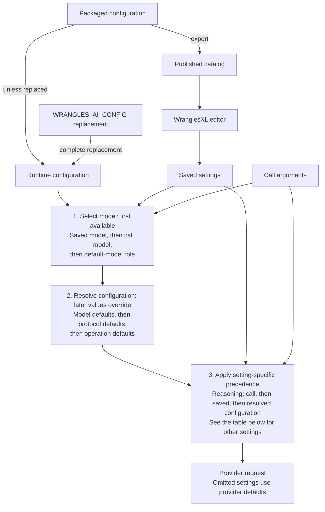

# AI model configuration

`wrangles/ai_defaults.yml` is the packaged source of AI model choices and
defaults. It groups models by provider and keeps model settings separate from
operation settings such as retries, concurrency, and timeouts.

## Callers and surfaces

A **caller** starts an AI operation. A **surface** is where a user authors or
runs it. A saved extraction model is a reusable definition, not another caller.

| Caller or surface | What it does | Where settings are supplied |
| --- | --- | --- |
| Python caller | Calls a function such as `wrangles.extract.ai(...)` or `wrangles.openai.embeddings(...)` | Python function arguments |
| Recipe caller | Runs a wrangle such as `extract.ai` or `create.embeddings` through WranglesPY, locally or on a hosted worker | Parameters on that recipe step |
| WranglesXL — save (`extract.ai` and `lookup.semantic`) | Authors and saves a reusable extraction or semantic-lookup definition | The saved definition: extraction fields or lookup columns, plus model settings |
| WranglesXL — run (`extract.ai` and `lookup.semantic`) | Applies a saved extraction or semantic lookup to selected worksheet data | The saved definition plus call arguments; the execution service supplies runtime defaults |

A recipe can use an inline extraction schema or refer to a saved extraction
model with `model_id`. Either way, the shared extraction runtime prepares the
provider request. WranglesXL's saved-model editor does not itself call OpenAI.

## Names for settings and defaults

The terms below move from configuration and saved definitions to defaults,
then to the arguments supplied for one call. The diagram and selection table
below show how these sources combine for extraction.

| Group | Term used in this guide | Meaning |
| --- | --- | --- |
| Configuration and saved definitions | Packaged configuration | The `ai_defaults.yml` shipped with a WranglesPY release |
| | Runtime configuration | The configuration loaded by the executing WranglesPY process: the packaged file, or the complete replacement selected by `WRANGLES_AI_CONFIG` |
| | Resolved configuration | Model defaults, then protocol defaults, then operation defaults combined for the selected model; later values override earlier ones |
| | Published catalog | A versioned JSON export of the packaged configuration for clients such as WranglesXL; it does not read a worker's replacement configuration |
| | Saved settings | Values stored with a saved definition; for extraction, these include `Settings.GPTModel` and `Settings.ReasoningEffort` |
| Defaults | Provider default | The behavior chosen by the AI provider when the request omits a setting |
| | Default-model role | A named purpose in a model's `default_for` list, such as `extract.ai` or `embeddings`, that selects that model when none is supplied |
| | Model defaults | Settings under `providers.<provider>.models.<model>.defaults` |
| | Protocol defaults | Settings under that model's `protocol_defaults.<protocol>`, used only for the selected request protocol |
| | Operation defaults | Settings under `operations.<operation>.defaults`, such as `operations.extract.ai.defaults.retries` |
| Individual call | Call arguments | Values supplied for this invocation: Python arguments or recipe-step parameters, such as `reasoning: {effort: none}` |

Set `WRANGLES_AI_CONFIG` to a replacement YAML file when a process needs its own
runtime configuration. Start from a complete copy of the packaged file. A
replacement must define each operation and provider it uses, plus the required
default model roles unless callers supply models explicitly. It does not inherit
missing operations from the packaged file.

Configuration is read locally and cached. Call
`wrangles.ai_config.clear_cache()` after changing a file already loaded by the
process. Keep credentials outside configuration and the published catalog.

## Providers, models, and operations

Model entries describe lifecycle, default roles, model defaults, and declared
supported parameter values. Operation entries select a provider and protocol
and hold runtime defaults such as concurrency, caching, and extraction prompts.

Optional `applications` metadata is a list of labels, such as `[embeddings]` or
`[data_extraction, description_writing]`. `default_for` assigns default-model
roles: labels that say which purpose should use a model by default. Neither
field is sent to the provider. Provider `documentation` links
are reference material; `endpoints` are request destinations.

This is an excerpt; a replacement file should contain the complete catalog:

```yaml
version: 2
providers:
  openai:
    endpoints:
      responses: https://api.openai.com/v1/responses
    models:
      gpt-6-luna:
        status: active
        applications: [data_extraction, description_writing]
        default_for: [global, test, extract.ai, generate.ai]
        defaults:
          reasoning:
            effort: none
          text:
            verbosity: low
        supported_values:
          reasoning.effort: [none, low, medium, high, xhigh, max]
          text.verbosity: [low, medium, high]
operations:
  extract.ai:
    provider: openai
    protocol: responses
    defaults:
      default_concurrency: 32
      request_timeout_seconds: 12
      retries: 1
```

### Model status and default-model roles

A **role** is a default-model assignment for a named purpose. For example,
`default_for: [extract.ai]` means "choose this model for extraction when no
saved or call-supplied model is selected." `default_for: [embeddings]` makes
the equivalent assignment for embedding requests. A role selects the model;
that model's defaults supply its settings.

`status` is `active`, `deprecated`, or `retired`. It describes catalog lifecycle,
not a live provider availability check. A model can hold several `default_for`
roles; each role has one default within a provider. Retired models cannot hold
default roles. Deprecated models remain usable, including as defaults.

Selecting a deprecated model logs a warning naming its provider and model, then
continues normally. This applies to call arguments, configured defaults, saved
definitions, and tests. The warning occurs once per operation, outside row and
retry loops. Reading the catalog does not emit warnings.

The `global` role is a fallback for text extraction and generation. Embeddings
and URL retrieval use their own roles. The `test` role is selected explicitly by
a test or trial runner; running pytest does not change normal model selection.
Callers may select unlisted models and dated snapshots explicitly. Provider
errors determine whether those models are actually available.

### Supported settings and protocol defaults

`supported_values` contains enum lists, not a separate boolean for each enum
member. Missing metadata means unknown support; an empty list means that setting
is unsupported. The catalog is maintained explicitly, without automatic provider
model discovery. Adding a provider entry does not implement its runtime adapter.

Use `protocol_defaults` for settings that apply only to a particular request
protocol. They override the model's general defaults before operation defaults
are applied.

The loader rejects malformed declarations, conflicting default roles, and model
defaults outside declared enums. It does not contact providers or validate keys.
Live extraction checks remain necessary when adopting a new model.

## How extraction selects settings

### How the layers fit together

The published catalog supplies the WranglesXL editor's choices and displayed
defaults. Execution uses the runtime configuration loaded by the worker. The
two share the packaged source, but a worker can use a replacement configuration.



### Selection order

The runtime first selects the model, then resolves configuration for that model,
then applies saved settings and call arguments where applicable. The selection
order is different for the model name and for reasoning:

| Setting | Selection order, first available value wins |
| --- | --- |
| Model | Saved settings (`GPTModel` and recognized aliases) -> call argument `model` -> runtime configuration's `extract.ai` default role, with `global` as fallback |
| Reasoning | Call argument `reasoning` -> saved setting `ReasoningEffort` -> resolved configuration's `reasoning` -> provider default |
| Text verbosity | Call argument `verbosity` -> resolved configuration's `text.verbosity` -> provider default |
| Retries, timeout, concurrency, storage, cache, and strictness | Call argument -> resolved configuration |

For example, a saved extraction model might contain `ReasoningEffort: low`:

- A recipe calling it with `reasoning: {effort: none}` requests `none`.
- The same recipe without a `reasoning` argument requests the saved `low` value.
- If the saved model also omits `ReasoningEffort`, the runtime uses the resolved
  configuration for the selected model. If that configuration omits reasoning,
  the request leaves it to the provider.

The model-name rule preserves the saved definition's selected model even when
the Python or recipe caller also supplies `model`. Saved model selection checks
`GPTModel`, `AIModel`, `model`, and `GPTModelName`, in that order, ignoring case
and punctuation. Null and empty-string values do not select a model.

Saved `ReasoningEffort` is a scalar string. Python and recipe calls use the
`reasoning` object. Declared reasoning and verbosity enums are checked against
the requested values; unsupported values produce a warning and are omitted.
The model's provider default then applies. These rules apply to both Responses
and Chat Completions. Omitted reasoning and verbosity stay omitted when no
setting source supplies them.

The packaged extraction default model sets `none` reasoning and `low` verbosity.
Those values are not automatically applied when a caller selects a different
model whose configuration leaves them unset. WranglesXL deliberately offers
only `none|low` reasoning choices to fit its current batch processing window.

All packaged operations use one additional retry after the first attempt.
`retries: 0` disables retries. Explicit call values such as `False` and `0` are
preserved. Timeout applies to each HTTP attempt; it is not a whole-batch deadline.
Endpoint overrides remain available in APIs that expose them.

Extraction uses its operation defaults directly. There is no named profile or
caller-selectable preset registry. Provider request options use allowlists so
runtime controls and catalog metadata do not leak into request payloads.

### Inspect the resolved configuration

Python callers can inspect defaults without making an AI request:

```python
from wrangles import ai_config

extraction = ai_config.resolve("extract.ai")
embeddings = ai_config.resolve("embeddings")
trial = ai_config.resolve("extract.ai", role="test")

assert ai_config.extract_ai() == extraction
```

`load()` returns a copy of the runtime configuration. `resolve()` and
`extract_ai()` return copies of resolved settings. Modifying these returned
dictionaries does not change the cached configuration.

## Configured AI Wrangles

| Operation | WranglesPY callers | Configured settings |
| --- | --- | --- |
| `extract.ai` | Python and recipe extraction, including WranglesXL extraction requests | Model, endpoints, tuning, concurrency, timeout, retries, strictness, storage, cache, prompt |
| `embeddings` | `openai.embeddings` and recipe `create.embeddings` | Provider, model, endpoint, batch size, concurrency, timeout, retries, precision, dimensions, Jina task/normalization/truncation |
| `ai.choose`, `ai.score`, `ai.true_false`, `ai.answers` | Python and recipe structured answers | Provider, model, endpoint, concurrency, timeout, retries, cache |
| `search.retrieve_link_content` | Python, recipe, and Gemini URL-context client | Model, endpoint/API version, concurrency, timeout, retries, temperature/top-p/top-k/token limits/stop sequences |
| `generate.ai` | Python and recipe generation; unreleased | Model, endpoint, reasoning/text tuning, concurrency, timeout, retries, strictness |
| `huggingface` | Generic recipe task wrangle | Explicit model, endpoint, timeout, retries, task parameters |

### Saved extraction in WranglesXL (`extract.ai`)

Saving stores the extraction definition and settings. Running that saved model
directly from WranglesXL builds a one-step `extract.ai` recipe containing its
`model_id` and sends it through `/recipe/run`. The user does not need to author
that recipe. The shared WranglesPY runtime loads the saved definition, resolves
settings, and makes the provider request. A user-authored recipe that refers to
the same saved model uses that runtime too.

**Use configured default** leaves the saved model selection absent, and
**Use model default** leaves saved reasoning absent. Execution then follows the
selection rules above. Choosing a particular model or reasoning effort stores
that choice in the saved settings.

WranglesXL offers only `none|low` reasoning values, filtered by the selected
model's declared support. Existing saved selections remain visible even when
unlisted or when the catalog cannot load. An explicit deprecated status produces
a warning without blocking execution. Catalog load failures offer a retry and
do not rewrite settings. A saved or inherited extended reasoning value is
flagged because of WranglesXL's batch processing window.

The editor displays packaged defaults. A worker's replacement runtime
configuration can differ, and that runtime configuration controls execution.
Publish the Python changes and catalog before releasing the corresponding
WranglesXL editor update.

### Saved semantic lookups in WranglesXL (`lookup.semantic`)

WranglesXL creates and updates semantic lookup definitions through
`/model/content` and runs them through `/wrangles/lookup`. Its current calls
identify the saved lookup, matching columns, returned columns, and result count;
they do not directly select a provider embedding model or dimensions.

The published catalog now includes embedding metadata for those consumers.
Adding that metadata does not change the lookup service's model selection or
rebuild existing indexes. Training and query embeddings must continue to use
compatible provider, model, and dimension settings; a changed catalog default
must not silently change the model used to query an existing index.

## Provider settings

### OpenAI

Extraction uses Responses by default. Chat Completions remains available through
`extract.ai(protocol="chat_completions")`. The packaged `gpt-6-luna` model holds
the extraction, generation, global, and test default roles.

Modern model entries leave temperature unset, so the provider chooses it.
GPT-4o Chat Completions entries configure `temperature: 0.2`.

Embedding model `text-embedding-3-small` holds the `embeddings` default role;
`text-embedding-3-large` is another catalog option. Embeddings keep their current
dimensions unless configured or supplied by the caller. The embedding operation
has independent defaults: batch size 100, concurrency 10, a 30-second timeout,
one retry, and `float32` precision. It does not inherit extraction settings.

OpenAI endpoint entries are complete URLs on `https://api.openai.com`:
`/v1/responses`, `/v1/chat/completions`, and `/v1/embeddings`.

Generation remains unreleased. Its operation sets `low` reasoning; its Python
and recipe strictness defaults are `strict` and `recipe_strict`, respectively.
WranglesJS note-generation functions still require a separate integration.

### Jina

Jina uses the complete endpoint `https://api.jina.ai/v1/embeddings`. It requires
an explicit model unless a Jina catalog entry holds the `embeddings` default
role. The packaged Jina entry does not currently hold that role. An explicit
Jina URL retains the embedding caller's provider inference.

`jina-embeddings-v5-omni-small` declares `task` values `retrieval.query`,
`retrieval.passage`, `text-matching`, `clustering`, and `classification`.
Its configured default is `text-matching`. Use `retrieval.passage` for indexed
documents and `retrieval.query` for search queries. Call argument `task` overrides
the model default and is checked against the model's enum. Other configurable
request settings include dimensions, normalization, truncation, and late
chunking. See the [Jina API schema](https://api.jina.ai/openapi.json).

### Google

Gemini URL retrieval uses Google's URL-context tools. The packaged model is
`gemini-3.8-flash`, with `temperature: 0.1` and `api_version: v1beta`.

`endpoints.base_url` is the SDK service root
`https://generativelanguage.googleapis.com`. The SDK appends the API version,
model, and method; the configured model's complete endpoint is
`https://generativelanguage.googleapis.com/v1beta/models/gemini-3.8-flash:generateContent`.
Both the service root and version are configurable. See the
[Google API reference](https://ai.google.dev/api/generate-content).

Model names with or without the SDK's `models/` prefix share catalog defaults;
declare only one spelling. `search.ai_mode` delegates model selection to
SerpAPI/Google and has no selectable language model in the WranglesPY API.

### Typesafe

The four structured-answer operations use Typesafe's `systemone` protocol at
`https://api.typesafe.ai/v1/systemone`, with `jev-1.13.0` as their default model:

- `ai.choose` selects the best-fitting option.
- `ai.score` locates the input along ordered criteria.
- `ai.true_false` returns the probability that a statement is true.
- `ai.answers` combines these question types in one request.

Each operation has its own default role; changing an extraction or global
default does not affect them. Explicit unlisted Typesafe model names remain
available. This adapter supports `provider: typesafe` and `protocol: systemone`.

Packaged defaults are concurrency 10, a 30-second timeout, and one retry.
Successful results use a bounded one-hour cache with at most 512 entries and
65,536 bytes per value. Duplicate in-flight requests share their result, and
periodic cache logging is disabled. `WRANGLES_AI_CACHE_*` controls apply
independently of `WRANGLES_EXTRACT_AI_CACHE_*`. See [AI answers](ai_answers.md).

Supply `api_key`, use the local `TYPESAFE_API_KEY` environment variable, or use
`api_key: ${TYPESAFE_API_KEY}` in a hosted recipe with that managed secret.
Hosted secrets are recipe variables, not worker environment variables.

### Hugging Face

The generic task wrangle requires an explicit `model`: different tasks cannot
share one default. Its operation declares `requires_model: true`. Model entries
can supply task-specific `parameters` and lifecycle status; call arguments
override configured parameters.

Requests use the configured HF Inference base plus the model ID, currently
`https://router.huggingface.co/hf-inference/models/{model}`. The wrangle preserves
raw JSON results and retries transient failures only. See the
[HF Inference reference](https://huggingface.co/docs/inference-providers/en/providers/hf-inference).

### Anthropic

The provider entry is reserved for a future adapter. It does not currently
enable Anthropic calls.

## Published catalog for WranglesXL

The published catalog contains both extraction and embedding information.
WranglesXL's extraction editor reads the extraction choices; embedding models
are kept in their own section for semantic-lookup consumers.

Generate the JSON from the repository root:

```sh
python schema/generate_ai_catalog.py
```

`schema/ai-models-v1.json` carries the JSON format's `schema_version` and the
WranglesPY `package_version`. Release workflows pass the exact release or RC
version using `--package-version`. This export reads packaged YAML, never a
worker's `WRANGLES_AI_CONFIG` replacement.

The top-level extraction fields contain model IDs, lifecycle status, resolved
reasoning defaults, and declared reasoning enums. The separate `embeddings`
object contains the selected embedding provider and default model, plus a
`providers` object containing each provider's models, lifecycle status, default
roles, resolved settings, and declared enums.

The packaged embedding section includes OpenAI's `text-embedding-3-small`
default and `text-embedding-3-large` option, plus Jina's
`jina-embeddings-v5-omni-small`. Jina's provider default is `null`: a caller must
select a model until one is assigned the `embeddings` role. Exported settings
include batch size, concurrency, timeout, retries, precision, and dimensions
when configured; Jina also includes configured task, normalization, truncation,
and late-chunking settings. Omitted dimensions remain omitted rather than
copying an assumed provider default.

Credentials, endpoints, prompts, and arbitrary provider parameters are excluded.
The export performs no provider discovery or availability checks.

CI saves the file as the `ai-model-catalog` artifact. Deployment workflows publish
that artifact after the matching Lambda deployment succeeds:

| Channel | Public path |
| --- | --- |
| DEV | `schema/ai/models-v1_dev.json` |
| PROD | `schema/ai/models-v1.json` |

WranglesXL loads these files from `https://public.wrangle.works`. Each channel
file identifies its snapshot with `package_version`. If publication fails, the
previous catalog remains available and the workflow fails. Before retrying,
confirm that the run's version is still deployed; otherwise publish the newer
deployment's artifact instead of replacing it with an old snapshot.
