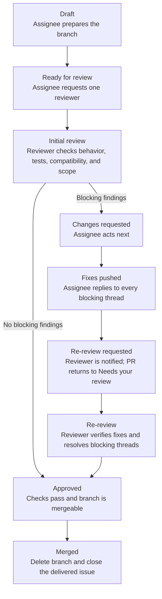
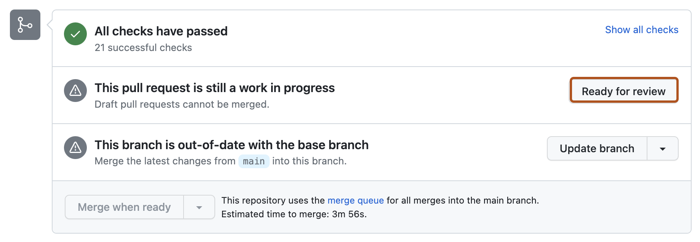
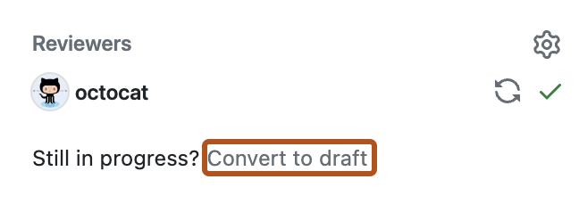
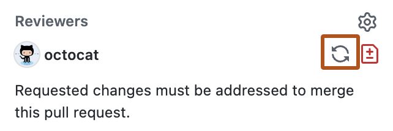

# Pull request workflow

GitHub is the system of record for work in WranglesPY. Keep ownership, review
state, and the next action visible through PR metadata, review requests, and
concise triage comments.

This workflow is designed for the Ukraine/Austin time-zone handoff: the assignee
should be able to end their day with an unambiguous next action, and the
reviewer should be able to start without reconstructing context.

## The fields we use

Every open PR must have:

- a linked issue, unless it is a very small housekeeping change;
- one human **Assignee**, who owns delivery and the next action;
- one primary **Reviewer** when the PR is ready for review;
- a milestone only when the change is actually intended for that release;
- a useful description of the behavior change and how it was tested; and
- the correct Draft or Ready for review state.

The assignee is normally the author. A bot may author code, but a bot is never
the delivery owner. Reviewers review; assignment does not mean "please review."

Throughout this document, **owner** is shorthand for the human delivery owner
recorded in GitHub's **Assignees** field. It does not mean the repository or
organization owner. Use **Assignee** when referring specifically to the GitHub
field and **owner** when discussing the person's responsibility.

## State and ownership

| GitHub state | Meaning | Who acts next |
| --- | --- | --- |
| Draft | In progress, conflicted, failing, being rescoped, or not ready for another review | Assignee |
| Ready + review requested | Complete enough for a decision; checks pass and the branch is current with `main` | Reviewer |
| Changes requested | At least one blocking review finding remains | Assignee |
| Re-review requested | The assignee pushed fixes, replied to every blocking thread, and re-requested the reviewer | Reviewer |
| Approved | Approval is current, all required checks pass, all blocking threads are resolved, and the branch is mergeable | Merger |
| Closed | Duplicate, superseded, abandoned, or intentionally returned to an issue | Nobody |

The PR's human assignee owns getting the branch current with `main` and
resolving merge conflicts, either directly or by coordinating with the branch
author. A reviewer should not have to begin a review by repairing the branch.

## Typical lifecycle

## Delivery-owner flow

1. Start from a linked issue and open a Draft PR early.
2. Assign the PR to one human delivery owner. The assignee owns the next action
   even when an AI agent authored the branch.
3. Keep the PR focused. Move unrelated work to another issue or PR.
4. Before marking it Ready, update it from `main`, run focused tests, and
   complete the PR description.
5. Mark it Ready and request one primary reviewer.
6. When changes are requested:
   - fix each blocking finding or explain why it should not change;
   - push the fixes and allow required checks to run;
   - reply in each corresponding review thread with the fixing commit or
     rationale;
   - do not resolve a thread merely because code was pushed; and
   - re-request review after every blocking thread has an answer and the PR is
     ready for another decision.

   The re-review request—not the push—is the handoff. It notifies the reviewer
   and returns the PR to the reviewer's **Needs your review** queue.
7. After merge, delete the head branch and close the linked issue if the issue
   is fully delivered.

## Reviewer flow

1. Review the behavior, tests, compatibility, and scope—not only formatting.
2. Put line-specific findings in inline review threads.
3. Use these severities:
   - **P0/P1:** must be fixed before merge;
   - **P2:** should be fixed before merge unless the reviewer explicitly
     accepts a follow-up issue; and
   - **P3:** non-blocking improvement; create or link a follow-up issue rather
     than holding the PR.
4. Submit **Request changes** when any blocking finding exists. Use Comment for
   questions or non-blocking observations.
5. On re-review, inspect the commits since the previous review and every
   unresolved thread. The reviewer—not the assignee—resolves a blocking thread
   after verifying the fix.
6. Submit a fresh approval after requested changes are satisfied. An old
   approval or an "outdated" thread is not evidence that the concern was
   resolved.

## GitHub controls

Use **Ready for review** when a Draft is complete enough for a review decision.

Use **Convert to draft** when substantial work remains, the branch conflicts,
required checks fail, or the approach is being reconsidered.

After responding to requested changes, click the circular-arrows
**Re-request review** icon beside the reviewer. This is the required handoff
signal.

The reviewer opens **Files changed**, inspects the commits since the previous
review, and uses **Review changes** to approve or request another round.

Screenshots are from GitHub's
[stage-change](https://docs.github.com/en/pull-requests/how-tos/create-pull-requests/changing-the-stage-of-a-pull-request),
[review-request](https://docs.github.com/en/pull-requests/how-tos/create-pull-requests/requesting-a-pull-request-review),
and
[approval](https://docs.github.com/en/pull-requests/how-tos/review-pull-requests/approving-a-pull-request-with-required-reviews)
documentation. GitHub may update the interface over time.

## Queue limits and response times

- At most five PRs should be Ready for review across the repository.
- An assignee should have at most two PRs Ready at once; additional work remains
  Draft.
- A primary reviewer should provide an initial review or a status response
  within one Austin business day.
- If a PR is inactive for seven days, the assignee must update it, return it to
  Draft with a next action, or close it back to its issue.
- Conflicted PRs and PRs with failing required checks remain Draft.

These limits make review the controlled work queue. Starting more code is not
progress when the Ready queue is full.

## Release lifecycle

Release milestones, freeze decisions, readiness, publication, and follow-up are
covered in the separate [release lifecycle](release-lifecycle.md). The document
currently records the interim milestone rules and the topics still to define.

## Daily GitHub views

These searches provide the shared queue:

- **My delivery work:** `is:pr is:open assignee:@me`
- **My reviews:** `is:pr is:open review-requested:@me draft:false`
- **Author action:** `is:pr is:open review:changes_requested`
- **Ready and waiting:** `is:pr is:open draft:false review:none`
- **Release PRs:** `is:pr is:open milestone:"v1.20"`
- **Unowned PRs:** `is:pr is:open no:assignee`
- **Stale PRs:** `is:pr is:open updated:<YYYY-MM-DD`

At least once each working day, each owner checks **My delivery work** and
leaves every assigned PR with accurate metadata, the correct Draft or Ready
state, and an unambiguous next action. Reviewers check **My reviews** for new
and re-requested reviews. The re-request is what returns a changed PR to that
review queue.

GitHub cannot search directly for every merge-conflict state in the PR search
box. During triage, check mergeability on each Ready PR; if it conflicts,
return it to Draft and assign the repair to its delivery owner.

## Twice-weekly queue triage

On Monday and Thursday, one Austin maintainer acts as queue captain:

1. clear unowned PRs;
2. cap the Ready queue and remove extra review requests;
3. return conflicted, failing, or incomplete PRs to Draft;
4. close clear duplicates and link the surviving PR or issue;
5. move unlikely work out of the release milestone; and
6. identify the next three review decisions for the Austin/Ukraine handoff.

The captain updates PR metadata and review requests directly in GitHub.
